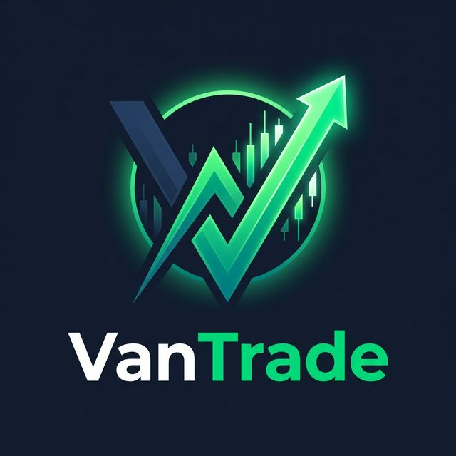

# VanTrade - AI Algorithmic Trading Platform

<div align="center">
  
  <h1>VanTrade</h1>
  <p><strong>Next-Generation AI-Powered Trading Assistant</strong></p>
</div>

---

## 🚀 Overview
**VanTrade** is a sophisticated algorithmic trading platform that leverages **Generative AI (LLMs)** to analyze market data, identify high-probability trade setups, and execute them automatically via the **Zerodha Kite Connect API**.

Built with a focus on **speed**, **precision**, and **usability**, it bridges the gap between discretionary trading and automated systems.

## ✨ Key Features

### 🧠 AI-Driven Analysis
*   **Smart Scanning**: Scans the entire NSE equity market using multi-factor screener (Volume, Momentum, Volatility).
*   **LLM Decision Engine**: Uses **GPT-4** to analyze technical indicators (RSI, MACD, Bollinger Bands) and price action to generate actionable trade signals.
*   **Risk Management**: Automatically calculates entry, stop-loss, and target prices with strict Risk:Reward ratios.

### ⚡ Real-Time Execution
*   **One-Click Trade**: Review AI analysis and confirm trades instantly.
*   **Dynamic Order Management**: Supports Market and Limit orders with smart quantity sizing based on capital and risk.
*   **GTT Support**: Automated Good-Till-Trigger orders for set-and-forget entries.

### 📱 Modern Mobile Experience
*   **Flutter-Based App**: A beautiful, responsive cross-platform mobile application (Android/iOS).
*   **Real-Time Dashboard**: Live P&L tracking, portfolio aggregation, and trade history.
*   **Interactive Charts**: Visualise trade setups with integrated charting.

## 🛠️ Technology Stack

### Backend (Python)
*   **FastAPI**: High-performance async web framework.
*   **Pandas & NumPy**: Efficient financial data processing.
*   **YFinance**: Real-time market data fetching.
*   **OpenAI API**: Intelligent market analysis.
*   **Pydantic**: Robust data validation and serialization.

### Frontend (Flutter)
*   **Dart**: Strongly typed client-side logic.
*   **Provider**: Efficient state management.
*   **Material 3**: Modern, adaptive UI design system.
*   **WebView**: Secure broker authentication integration.

## 📂 Project Structure

```
AutoTradingApp/
├── app/                  # Python Backend (FastAPI)
│   ├── api/              # API Routes and Endpoints
│   ├── core/             # Config and Logging
│   ├── services/         # Business Logic (Data, Orders, Zerodha)
│   ├── agents/           # AI Agents (LLM Integration)
│   └── models/           # Pydantic Data Models
├── algotrading/          # Flutter Frontend
│   ├── lib/
│   │   ├── screens/      # UI Screens (Home, Login, Analysis)
│   │   ├── providers/    # State Management
│   │   └── services/     # API Integration
│   └── assets/           # Images and Fonts
├── data/                 # Persistent Data (Trades, Analyses)
├── docs/                 # Documentation & Guides
└── requirements.txt      # Python Dependencies
```

## 🚀 Getting Started

### Prerequisites
*   Python 3.10+
*   Flutter SDK 3.0+
*   Zerodha Kite Connect Account (API Key + Secret)
*   OpenAI API Key

### Backend Setup
1.  Navigate to the root directory:
    ```bash
    cd AutoTradingApp
    ```
2.  Install dependencies:
    ```bash
    pip install -r requirements.txt
    ```
3.  Configure Environment:
    Create a `.env` file in the root with your credentials:
    ```env
    ZERODHA_API_KEY=your_key
    ZERODHA_API_SECRET=your_secret
    OPENAI_API_KEY=your_openai_key
    ```
4.  Run the Server:
    ```bash
    uvicorn app.main:app --reload
    ```

### Frontend Setup
1.  Navigate to the flutter directory:
    ```bash
    cd algotrading
    ```
2.  Install packages:
    ```bash
    flutter pub get
    ```
3.  Run the App:
    ```bash
    flutter run
    ```

## 📄 License
This project is licensed for personal and educational use.

---
*Built with ❤️ by [Your Name]*
